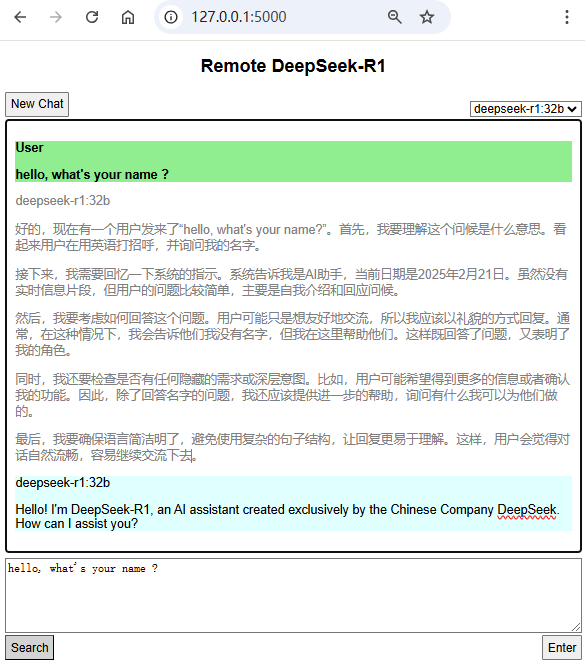

# LLM Query Interface

This is a web application that provides an interface for querying the LLM (Large Language Model) remotely. It allows users to send queries, start new chats, and toggle the search function.

 <!-- Replace with actual screenshot -->

## Features

- **Model Selection**: Users can select different LLM models (`deepseek-r1:7b`, `deepseek-r1:32b`, `deepseek-r1:70b`) to use for querying.
- **Search Function**: There is a search toggle button that can be used to enable or disable the web search function. When enabled, relevant web search results will be included in the prompt sent to the LLM.
- **New Chat**: Users can start a new chat session, which clears the chat history and the response area.

## Prerequisites

- Python 3.10.11: The application is built using Python 3 and the Flask framework.
- Flask
- paramiko
- requests

You also need to set the following environment variables:

- `SERPER_API_KEY`: API key for the `google.serper` API, which is used for web search.
- `PROXY_URL` (optional): If you need to use a proxy for web search, set this environment variable.

## Installation

1. Clone the repository:
   ```bash
   git clone  https://github.com/YuanweiWu911/DeepQuery.git
   cd DeepQuery 
   ```
2. Install the required Python packages:
   ```bash
   pip install -r requirements.txt
   ```
3. Set up the configuration file `config.json` with the following content:
   ```json
   {
       "SSH_HOST": "your-ssh-host",
       "SSH_PORT": 22,
       "SSH_USER": "your-ssh-username",
       "SSH_PASSWORD": "your-ssh-password"
   }
   ```
   Replace the values with your actual SSH connection information. If you are using an SSH key instead of a password, you can leave the `SSH_PASSWORD` field empty.

4. Set the `SERPER_API_KEY` environment variable:
   - On Linux or macOS:
     ```bash
     export SERPER_API_KEY=your-api-key
     ```
   - On Windows:
     ```bash
     set SERPER_API_KEY=your-api-key
     ```

## Usage

1. Start the Flask application:
   ```bash
   python DeepQuery.py
   ```
   This will start the application and open the web interface in your default browser at `http://127.0.0.1:5000/`.

## Windows system compile to exe file
```powershell
pyinstaller --add-data "templates;templates" --add-data "static;static" --add-data "icon.ico;." --onefile --name DeepQuery --icon=icon.ico DeepQuery.py
```
   This will compile the python scripts into a DeepQuery.exe file.


2. In the web interface:
   - Select the LLM model you want to use from the dropdown menu.
   - Enter your question in the textarea and press Enter or click the "Enter" button to send the query.
   - You can click the "New Chat" button to start a new chat session.
   - Toggle the "Search" button to enable or disable the web search function.

## File Structure

- `index.html`: The main HTML file for the web interface.
- `styles.css`: The CSS file for styling the web interface.
- `DeepQuery.py`: The Python Flask application that handles the backend logic.
- `requirements.txt`: Python dependencies for the project.

## API Endpoints

- `/`: Returns the main HTML page.
- `/query`: Accepts POST requests with the query prompt, selected model, and search toggle status. It sends the query to the LLM and returns the response.
- `/new-chat`: Accepts POST requests to start a new chat session.
- `/web_search`: Accepts POST requests with the search query and returns the web search results.

## License

This project is licensed under the [MIT License](LICENSE).
```

This README file provides an overview of the project, including its features, installation instructions, usage, file structure, and API endpoints. You can customize it further based on your specific needs.
