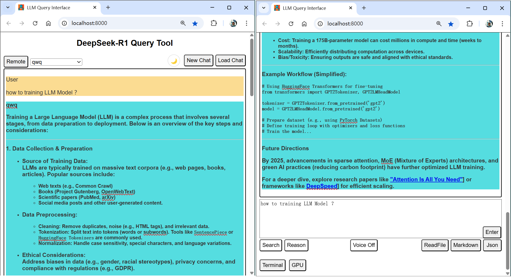

# 网页版本地-远程服务器 LLM 对话程序

这是一个提供远程查询大型语言模型（LLM）接口的网络应用程序。它允许用户发送查询请求、开启新的聊天会话以及切换搜索功能。

 <!-- 请替换为实际截图 -->

## 功能特点

- **本地/远程**：选择本地将使用本地的 LLM 模型，选择远程则使用远程服务器的 LLM 模型。
- **模型选择**：用户可以选择不同的 LLM 模型（`deepseek-r1:7b`、`deepseek-r1:32b`、`deepseek-r1:70b`）来进行查询。
- **网络搜索**：有一个搜索切换按钮，可用于启用或禁用网络搜索功能。启用后，相关的网络搜索结果将包含在发送给 LLM 的提示信息中。
- **推理**：有一个推理切换按钮，可用于启用或禁用推理功能。这可能会用于从 LLM 获得更详细、更符合逻辑的解释。
- **文本语音**：用户可以启用或禁用语音功能，具体实现可能用于文本转语音或语音转文本。
- **新聊天**：用户可以开始一个新的聊天会话，这将清除聊天历史记录和响应区域。
- **加载聊天**：用户可以从 JSON 文件中加载之前保存的聊天会话。
- **保存聊天**：用户可以将聊天内容保存为以下两种格式：
  - **JSON**：聊天消息将保存为 JSON 文件，可用于以结构化格式存储对话历史记录。
  - **Markdown**：AI 响应内容可以保存为 Markdown 文件，便于分享或进一步处理。

## 先决条件

- Python 3.10：该应用程序使用 Python 3 和 fastapi 框架构建。
- fastapi
- paramiko
- requests
- pyinstaller
- uvicorn
- websockets

你还需要设置以下环境变量：

- `SERPER_API_KEY`：`google.serper` API 的密钥，用于网络搜索。
- `PROXY_URL`（可选）：如果你需要使用代理进行网络搜索，请设置此环境变量。

## 安装步骤

1. 克隆存储库：
   ```bash
   git clone  https://github.com/YuanweiWu911/DeepQuery.git
   cd DeepQuery
   ```
2. 安装所需的 Python 包：
   ```bash
   pip install -r requirements.txt
   ```
3. 设置配置文件 `config.json`，内容如下：
   ```json
   {
       "SSH_HOST": "your-ssh-host",
       "SSH_PORT": 22,
       "SSH_USER": "your-ssh-username",
       "SSH_PASSWORD": "your-ssh-password"
       "SERPER_API_KEY":"your-serper-api-key"
   }
   ```
   请将这些值替换为你实际的 SSH 连接信息。如果你使用 SSH 密钥而非密码，可以将 `SSH_PASSWORD` 字段留空。

## 使用方法

1. 启动 FastAPI 应用程序：
   ```bash
   python DeepQuery.py
   ```
   这将启动应用程序，并在你默认的浏览器中打开网络界面，地址为 `http://127.0.0.1:5000/`。

## Windows 系统编译为 exe 文件
```powershell
pyinstaller build.spec
```
   这将把 Python 脚本编译为一个 DeepQuery.exe 文件。

2. 在网络界面中：
   - 选择你要使用的本地或远程 LLM 模型。
   - 从下拉菜单中选择你要使用的 LLM 模型。
   - 切换“搜索”按钮以启用或禁用网络搜索功能。
   - 切换“推理”按钮以显示 AI 的思考过程。
   - 切换“语音”按钮以开启或关闭 AI 响应的语音播放。
   - 在文本区域输入你的问题，然后按回车键或点击“发送”按钮以发送查询请求。
   - 你可以点击“新聊天”按钮开始一个新的聊天会话。
   - 你可以点击“加载聊天”按钮加载 JSON 格式的历史聊天会话。
   - 你可以点击“JSON”按钮将对话保存为历史聊天会话，以备将来使用。
   - 你可以点击“Markdown”按钮将对话保存为 Markdown 文件。

## 文件结构

- `index.html`：网络界面的主 HTML 文件。
- `styles.css`：用于设置网络界面样式的 CSS 文件。
- `DeepQuery.py`：处理后端逻辑的 Python FastAPI 应用程序。
- `requirements.txt`：项目的 Python 依赖项。

## API 端点

- `/`：返回主 HTML 页面。
- `/query`：接受包含查询提示、所选模型和搜索切换状态的 POST 请求。它将查询发送给 LLM 并返回响应。
- `/new-chat`：接受 POST 请求以开始一个新的聊天会话。
- `/web_search`：接受包含搜索查询的 POST 请求并返回网络搜索结果。

## 许可证

本项目基于 [MIT 许可证](LICENSE) 授权。

这个 README 文件提供了项目的概述，包括其功能、安装说明、使用方法、文件结构和 API 端点。你可以根据自己的具体需求进一步定制它。

